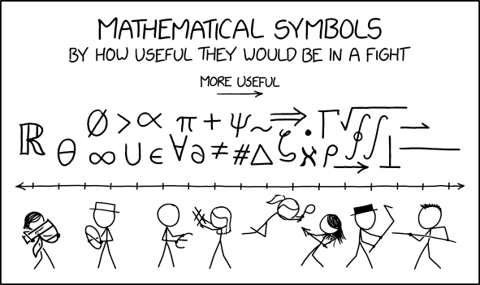

# LOG1810 Structures Discrètes Archives
Archives des matériaux du cours LOG1810 sur les structures discrètes. Enjoy!

**Contrôles périodiques passés**

1. **CP1 corrections :**

- _Automne_ 2021 [CP1-A21.pdf](/archives/cps/cp1/CP1-prof.pdf)
- _Hiver_ 2022 [CP1-H22.pdf](/archives/cps/cp1/LOG2810-H2022-CP1-Solutionnaire.pdf)
- _Été_ 2022 [CP1-E22.pdf](/archives/cps/cp1/LOG2810-E2022-CP1-Solutionnaire.pdf)
- _Automne_ 2022 [CP1-A22.pdf](/archives//cps/cp1/LOG2810-A2022-CP1-Solutionnaire.pdf)
- _Hiver_ 2023[CP1-H23.pdf](/archives/cps/cp1/LOG2810-H2023-CP1-Solutionnaire.pdf)
- _Été_ 2023 [CP1-E23.pdf](/archives//cps/cp1/LOG1810-E2023-CP1-Solutionnaire.pdf)
- _Automne_ 2023 [CP1-A23.pdf](/archives/cps/cp1/LOG1810-A2023-CP1-Solutionnaire.pdf)

2. **CP2 corrections :**

- _Automne_ 2021 [CP2-A21.pdf](/archives/cps/cp2/CP2-prof.pdf)
- _Hiver_ 2022 [CP2-H22.pdf](/archives/cps/cp2/LOG2810-H2022-CP2-Solutionnaire.pdf)
- _Été_ 2022 [CP2-E22.pdf](/archives/cps/cp2/LOG2810-E2022-CP2-Solutionnaire.pdf)
- _Automne_ 2022 [CP2-A22.pdf](/archives/cps/cp2/LOG2810-A2022-CP2-Solutionnaire.pdf)
- _Hiver_ 2023 [CP2-H23.pdf](/archives/cps/cp2/LOG2810-H2023-CP2-Solutionnaire.pdf)
- _Été_ 2023 [CP2-E23.pdf](/archives/cps/cp2/LOG1810-E2023-CP2-Solutionnaire.pdf)
- _Automne_ 2023 [CP2-A23.pdf](/archives/cps/cp2/LOG1810-A2023-CP2-Solutionnaire.pdf)

3. **CP3 corrections :**
- _Automne_ 2021 [CP3-A21.pdf](/archives/cps/cp3/CP3-prof.pdf)
- _Hiver_ 2022 [CP3-H22.pdf](/archives/cps/cp3/LOG2810-H2022-CP3-Solutionnaire.pdf)
- _Été_ 2022 [CP3-E22.pdf](/archives/cps/cp3/LOG2810-E2022-CP3-Solutionnaire.pdf)
- _Automne_ 2022 [CP3-A22.pdf](/archives/cps/cp3/LOG2810-A2022-CP3-Solutionnaire.pdf)
- _Hiver_ 2023 [CP3-H23.pdf](/archives/cps/cp3/LOG2810-H2023-CP3-Solutionnaire.pdf)
- _Été_ 2023 [CP3-E23.pdf](/archives/cps/cp3/LOG1810-E2023-CP3-Solutionnaire.pdf)
- _Automne_ 2023 [CP3-A23.pdf](/archives/cps/cp3/LOG1810-A2023-CP3-Solutionnaire.pdf)

**Travaux dirigés passés**

1. TD1 _Logique-prop_ [A21](/archives/tds/td1/TD1-prof.pdf), [H22](/archives/tds/td1/TD1-Solution.pdf), [E22](/archives/tds/td1/TD1-E2022-Solution.pdf), [A22](/archives/tds/td1/LOG2810-TD1_A22-solutions.pdf), [H23](/archives/tds/td1/TD1-H23-Solution.pdf), [E23](/archives/tds/td1/TD1-E23-Solution.pdf), [A23](/archives/tds/td1/TD1-A23-Solution.pdf)
2. TD2 _Logique-pred_ [A21](/archives/tds/td2/TD2-prof.pdf), [H22](/archives/tds/td2/TD2-Solution.pdf), [E22](/archives/tds/td2/TD2-E2022-Solution.pdf), [A22](/archives/tds/td2/LOG2810-TD2_A22-solutions.pdf), [H23](/archives/tds/td2/TD2-H23-Solution.pdf), [E23](/archives/tds/td2/TD2-E23-Solution.pdf), [A23](/archives/tds/td2/TD2-A23-Solution.pdf)
3. TD3 _Preuves_ [A21](/archives/tds/td3/TD3-prof.pdf), [H22](/archives/tds/td3/TD3-H2022-Solution.pdf), [E22](/archives/tds/td3/TD3-E2022-Solution.pdf), [A22](/archives/tds/td3/LOG2810-TD3_A22-solutions.pdf), [H23](/archives/tds/td3/TD3-H23-Solution.pdf), [E23](/archives/tds/td3/TD3-E23-Solution.pdf), [A23](/archives/tds/td3/TD3-A23-Solution.pdf)
4. TD4 _Ensembles_ [A21](/archives/tds/td4/TD4-prof.pdf), [H22](/archives/tds/td4/TD4-H2022-Solution.pdf), [E22](/archives/tds/td4/TD4-E23-Solution.pdf), [A22](/archives/tds/td4/LOG2810-TD4_A22-solutions.pdf), [H23](/archives/tds/td4/TD4-H23-Solution.pdf), [E23](/archives/tds/td4/TD4-E23-Solution.pdf), [A23](/archives/tds/td4/TD4-A23-Solution.pdf)
5. TD5 _Relations_ [A21](/archives/tds/td5/TD5-prof.pdf), [H22](/archives/tds/td5/TD5-H2022-Solution.pdf), [E22](/archives/tds/td5/TD5-E2022-Solution.pdf), [A22](/archives/tds/td5/LOG2810-TD5_A22-solutions.pdf), [H23](/archives/tds/td5/TD5-H23-Solution.pdf), [E23](/archives/tds/td5/TD5-E23-Solution.pdf), [A23](/archives/tds/td5/TD5-A23-Solution.pdf)
6. TD6 _Algorithmes_ [A21](/archives/tds/td6/TD6-prof.pdf), [H22](/archives/tds/td6/TD6-H2022-Solution.pdf), [E22](/archives/tds/td6/TD6-E2022-Solution.pdf), [A22](/archives/tds/td6/LOG2810-TD6_A22-solutions.pdf), [H23](/archives/tds/td6/TD6-H23-Solution.pdf), [E23](/archives/tds/td6/TD6-E23-Solution.pdf), [A23](/archives/tds/td6/TD6-A23-Solution.pdf)
7. TD7 _Théorie Nombres_ [A21](/archives/tds/td7/TD7-prof.pdf), [H22](/archives/tds/td7/TD7-H2022-Solution.pdf), [E22](/archives/tds/td7/TD7-H2022-Solution.pdf), [A22](/archives/tds/td7/LOG2810-TD7_A22-solutions.pdf), [H23](/archives/tds/td7/TD7-H23-Solution.pdf), [E23](/archives/tds/td7/TD7-E23-Solution.pdf), [A23](/archives/tds/td7/TD7-A23-Solution.pdf) + [epgcd](https://github.com/jaunewick/python-extended-euclidean-algorithm-log1810) (Script Python Euclide étendu)
8. TD8 _Induction_ [A21](/archives/tds/td8/TD8-prof.pdf), [H22](/archives/tds/td8/TD8-H2022-Solution.pdf), [E22](/archives/tds/td8/TD8-E2022-Solution.pdf), [A22](/archives/tds/td8/LOG2810-TD8-correction.pdf), [H23](/archives/tds/td8/TD8-H23-Solution.pdf), [E23](/archives/tds/td8/TD8-E23-Solution.pdf), [A23](/archives/tds/td8/TD8-A23-Solution.pdf)
9. TD9 _Dénombrements_ [A21](/archives/tds/td9/TD9-prof.pdf), [H22](/archives/tds/td9/TD9-H2022-Solution.pdf), [E22](/archives/tds/td9/TD9-E2022-Solution.pdf), [A22](/archives/tds/td9/LOG2810-TD9_A22-solutions.pdf), [H23](/archives/tds/td9/TD9-H23-Solution.pdf), [E23](/archives/tds/td9/TD9-E23-Solution.pdf), [A23](/archives/tds/td9/TD9-A23-Solution.pdf)
10. TD10 _Graphes_ [A21](/archives/tds/td10/TD10-prof.pdf), [H22](/archives/tds/td10/TD10-H2022-Solution.pdf), [E22](/archives/tds/td10/TD10-E2022-Solution.pdf), [A22](/archives/tds/td10/LOG2810-TD10_A22-solutions.pdf), [H23](/archives/tds/td10/TD10-A23-Solution.pdf), [E23](/archives/tds/td10/TD10-E23-Solution.pdf), [A23](/archives/tds/td10/TD10-A23-Solution.pdf)
11. TD11 _Arbres_ [A21](/archives/tds/td11/TD11-prof.pdf), [H22](/archives/tds/td11/TD11-H2022-Solution.pdf), [E22](/archives/tds/td11/TD11-E2022-Solution.pdf), [A22](/archives/tds/td11/LOG2810-TD11_A22-solution.pdf), [H23](/archives/tds/td11/TD11-E23-Solution.pdf), [E23](/archives/tds/td11/TD11-E23-Solution.pdf), [A23](/archives/tds/td11/TD11-A23-Solution.pdf)
12. TD12 _Langage pt.1_ [A21](/archives/tds/td12/TD12-prof.pdf), [H22](/archives/tds/td12/TD12-H2022-Solution.pdf), [E22](/archives/tds/td12/TD12-E2022-Solution.pdf), [A22](/archives/tds/td12/LOG2810-TD12_A22-solutions.pdf), [H23](/archives/tds/td12/TD12-H23-Solution.pdf), [E23](/archives/tds/td12/TD12-H23-Solution.pdf), [A23](/archives/tds/td12/TD12-A23-Solution.pdf)
13. TD13 _Langage pt.2_ [A21](/archives/tds/td13/TD13-prof.pdf), [H22](/archives/tds/td13/TD13-H2022-Solution.pdf), [H23](/archives/tds/td13/TD13-H23-Solution.pdf), [E23](/archives/tds/td13/TD13-E23-Solutionnaire.pdf), [A23](/archives/tds/td13/TD13-A23-Solutionnaire.pdf)

**Autres Ressources**

- Lien vers mon autre repo avec des ressources utiles pour le cours : [mon autre repo](https://github.com/jaunewick/python-extended-euclidean-algorithm-log1810).

- Pour plus d'information : daniel.giao@icloud.com
